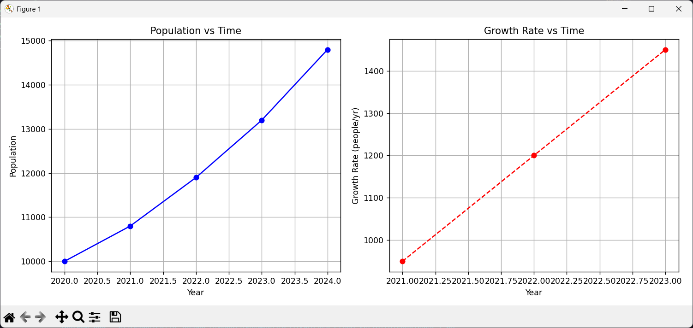
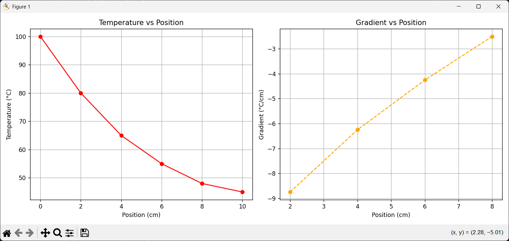
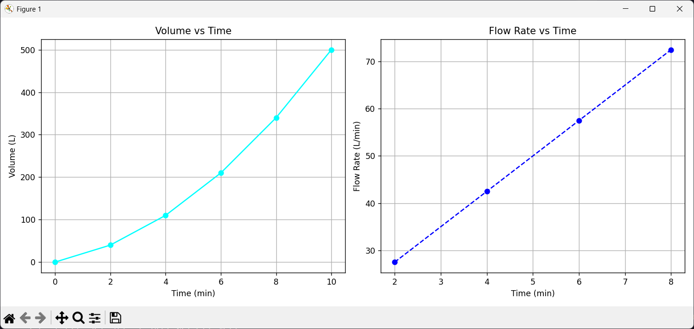

# CS ELEC 01 - Computational Science: Unit 4 Case Studies
## Contributors
* Felix Joseph Dinopol
* Christian Jay Lucañas
* John Kierve Gardonia


## Overview
This repository contains the comprehensive Python implementations, numerical computations, and visualizations for **Finals Activity 1 in CS ELEC 01 (Computational Science)**. The activity focuses on applying numerical methods to real-world datasets where continuous functions are unavailable. 

By utilizing **Numerical Differentiation** (specifically the Central Difference Method) and **Numerical Integration** (Trapezoidal Rule and Simpson's 1/3 Rule), we bridge the gap between discrete data points and continuous analysis across various fields, including demographics, thermodynamics, and fluid dynamics.

---

## Case Study 1: Population Growth Analysis

### Scenario
A local government needs to analyze population changes over a 5-year period (2020-2024) using only yearly census data. 

### Methodology & Explanations
* **Numerical Differentiation:** We used the **Central Difference Method** ($P'(t) \approx \frac{P(t+1) - P(t-1)}{2}$) to estimate the instantaneous population growth rate for the interior years (2021, 2022, 2023). This method was chosen because it uses data from both the preceding and succeeding years to calculate a more accurate slope at a specific point compared to forward or backward difference methods.
* **Numerical Integration:** We applied the **Trapezoidal Rule** to estimate the total population change (area under the curve) from 2020 to 2024. This calculates the cumulative "population-years" experienced by the municipality.

### Findings (Computed Results)
* **Growth Rate 2021:** 950 people/year
* **Growth Rate 2022:** 1,200 people/year
* **Growth Rate 2023:** 1,450 people/year
* **Total Integrated Population (2020-2024):** 48,300 population-years

### Conclusions & Analysis
* **Acceleration:** The growth accelerated the most recently, jumping from a rate of 1,200 in 2022 to 1,450 in 2023 (an increase of 250 in the rate).
* **Growth Trend:** The population growth is **exponential**. We can confirm this because the first derivative (the growth rate) is steadily increasing over time, rather than remaining constant (which would indicate linear growth).
* **Prediction:** Assuming the rate continues to increase by approximately 250 people/year, the 2024 growth rate would be roughly 1,700. Adding this to the 2024 population (14,800) predicts a **2025 population of ~16,500**.



---

## Case Study 3: Diffusion Process Simulation (Heat Spread)

### Scenario
Engineers need to estimate how heat spreads along a metal rod heated at one end over time, using discrete temperature measurements taken at 2cm intervals.

### Methodology & Explanations
* **Temperature Gradient:** We utilized the Central Difference Method with a step size of $h = 2\text{ cm}$ ($\frac{dT}{dx} \approx \frac{T(x+h) - T(x-h)}{2h}$) to calculate the temperature gradient at interior points. The gradient tells us how rapidly the temperature is dropping per centimeter at any given point.
* **Total Heat Distribution:** To integrate the temperature over the 10cm rod, we utilized a combination approach for maximum accuracy. Since we have 6 data points (5 intervals), we applied **Simpson's 1/3 Rule** for the first 4 intervals (which provides a highly accurate parabolic approximation) and the **Trapezoidal Rule** for the final interval.

### Findings (Computed Results)
* **Gradient at x=2:** -8.75 °C/cm
* **Gradient at x=4:** -6.25 °C/cm
* **Gradient at x=6:** -4.25 °C/cm
* **Gradient at x=8:** -2.50 °C/cm
* **Integrated Heat Value:** 638.33 °C-cm

### Conclusions & Analysis
* **Heat Transfer Rate:** Heat transfer is occurring fastest closest to the heat source (at x=2), indicated by the steepest negative gradient (-8.75 °C/cm).
* **Cooling Trend:** The temperature decreases **non-linearly** (displaying exponential decay). The magnitude of the gradient shrinks as we move down the rod, meaning the rate of cooling slows down.
* **Equilibrium:** Farther from the heat source, the gradient flattens (approaching 0). This indicates that the rod is approaching a state of thermal equilibrium with the ambient environment.



---

## Case Study 4: Water Tank Filling Rate Analysis

### Scenario
Sensors record the volume of water (in liters) entering a tank every 2 minutes. Engineers need to determine the rate of inflow and the total accumulated volume.

### Methodology & Explanations
* **Inflow Rate:** We calculated the derivative of the volume with respect to time using the Central Difference Method ($h=2$). This translates the raw volume measurements into an active flow rate (Liters per minute) at different time intervals.
* **Total Volume:** We used the Trapezoidal Rule to integrate the volume data points over the 10-minute period, yielding the total accumulated volume.

### Findings (Computed Results)
* **Flow Rate at t=2:** 27.5 L/min
* **Flow Rate at t=4:** 42.5 L/min
* **Flow Rate at t=6:** 57.5 L/min
* **Flow Rate at t=8:** 72.5 L/min
* **Total Integrated Volume:** 1,900 L-min

### Conclusions & Analysis
* **Flow Consistency:** The flow rate is **not constant**. It steadily increases from 27.5 L/min to 72.5 L/min over the observed period.
* **Peak Inflow:** The inflow is fastest at the very end of the recorded period (t=8), and the trend suggests it will continue to increase.
* **System Behavior:** The system is **accelerating**. The rate of inflow is increasing by a constant 15 L/min every 2 minutes. Because the first derivative is increasing, the second derivative is positive, confirming a positive acceleration in the water flow.



---

## Technologies Used
* **Python 3:** Core programming language.
* **NumPy:** Utilized for array-based mathematical operations, facilitating clean implementations of the numerical formulas without heavy loops.
* **Matplotlib:** Used to generate side-by-side plots of the raw data and the computed derivatives for visual analysis.

## How to Run the Code
1.  Ensure Python is installed on your system.
2.  Install the required dependencies via terminal/command prompt:
    ```bash
    pip install numpy matplotlib
    ```
3.  Execute the main computation script:
    ```bash
    python computational_activity.py
    ```
